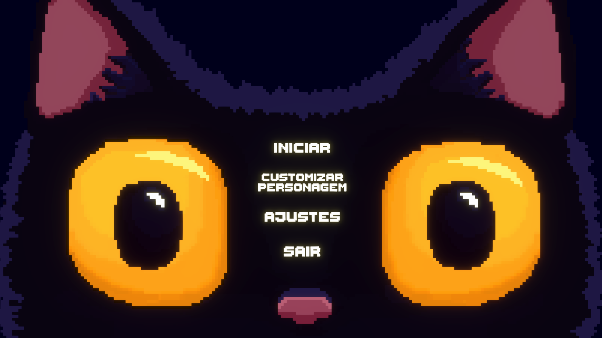

<head> 
   
<head>
  
  

    <h1  align="center">Unnamed Game About Cats and Dungeons</h1>
  

  
  
Um gato mago guerreiro, que desde pequeno, escuta histórias de seu pai sobre como todos os gatos da família foram heróis, então sente-se obrigado a seguir os passos da família para honrar as tradições. Ele decide pegar seu amuleto, que porta uma espada, e encontra uma masmorra para explorar. No entanto, o que ele não imaginava era que seus medos de fracasso e inseguranças dificultariam seu processo. Sempre que comete uma pequena falha, sua mente o perturba, como se houvesse um monstro o acompanhando durante sua jornada.

  ## Menu
  

     
    
  

  
 O menu inicia em uma tela com a logo do jogo, que ao clicar em qualquer tecla uma animação de gato se inicia e os botões do menu principal aparecem

  ___

  ### Menu Principal
  

     
    
  

  

  O menu principal apresenta quatro botões, cada um deles levando à uma área diferente:

  - **Iniciar:** faz o jogo começar
  - **Customização:** leva ao painel de customização do personagem principal do jogo
  - **Ajustes:** leva ao painel de ajustes do jogo
  - **Sair:** faz sair do jogo

  <!-- ___

  ### Painel de Customização
  

     
    
  

  

  No painel de customização do jogo é possível customizar a aparência do personagem principal do jogo
 -->

  ___

  ### Painel de Ajustes
  

     
    
  

  

  No painel de ajustes do jogo é possível encontrar diversas opções de configurações do jogo, incluindo: 

  #### Volume
  - Geral
  - Música
  - Efeitos sonoros
  #### Acessibilidade
  - **Leitura de Tela**: Acrecenta um leitor de tela ao jogo que lê qualquer conteúdo que contenha texto
  - **Modo deficiência visual**: modo de jogo em que é possível ser jogado mesmo sem o uso da visão
    
  - **Modo alto contraste**: modo de jogo com o intuito de auxiliar aqueles que têm baixa visão
  
  - **Modo Daltonismo**: conta com filtro para os 3 diferentes tipos de daltonismo: Deuteranopia, Tritanopia e Protanopia
   #### Remapeamento de controles
  Botão que leva a um menu para redefinir os controles usados no jogo

  ___
  ### Remapeamento de controles
   

     
      
  
  **Funcionamento** 
  Basta clicar em uma das opções de tecla que deseja alterar, e depois clicar na tecla que deseja usar no lugar da anterior
  - **Reset**: Retorna a definição da sua respectiva tecla para o padrão
    
  - **Restaurar Controles**: Retorna todas as teclas para a definição padrão
  

___
  ## Jogo
  ### Jogabilidade
  O gato corre infinitamente por plataformas irregulares **geradas automaticamente**, que contém diversos elementos
  <!-- Imagem dele andando -->
  É possível se mover em 2 direções, que variam dependendo se são plataformas **verticais** (esquerda e direita) ou **horizontais** (cima e baixo)
  <!-- Imagem dele espadando coisas -->
  Com sua espada o gato pode desferir ataques grandes e circulares para derrotar inimigos no seu caminho. A espada é poderosa, porém, ela não pode ser usada a todo momento 

  ### Pontuação
  <!-- Imagem com enfoque nos pontos, (talvez com uma seta?) -->
  
  ### Elementos
  #### Bons
  <!--  Flexbox com imagens com enfoque nas moedas e poder  -->
  - Moedas: aumenta pontuação geral e de moedas
  - Poder de imortalidade: deixa personagem imortal por alguns segundos
  <!-- - Poder de pontuação: faz ganhar pontuação dobrada por alguns segundos -->
  #### Ruins
  <!-- Flexbox com imagens com enfoque nos inimigos e armadilhas -->
  - **Armadilhas**: causam dano no personagem
  - **Inimigos**: causam dano no personagem, mas podem ser atacados

  ### Menus
  #### Menu de pause
  <!-- Imagem menu pause -->
  O menu de pause conta com três opções de botões diferentes, sendo eles:
  - Continuar Jogo
  - Reiniciar jogo
  - Voltar ao menu
  #### Menu de Game over
  <!-- Imagem menu gameover -->
  O menu de GameOver mostra ao jogador seu desempenho no último jogo, informando a **pontuação** adquirida, a **distância** percorrida e as **moedas** coletadas. Além de contar com duas opções de botões, sendo eles:
  - Reiniciar jogo
  - Voltar ao menu

  ## Modos de acessibilidade
  ### Modo audio binaural
  - Áudio binaural para identificar onde estão elementos
  - Mapa somente na vertical
  - Menos elementos para não ter sobrecarga de sons
  ### Modo alto contraste
  - Cada tipo de elemento e o personagem, têm uma cor única destacada do fundo
  - Fundo tem menos destaque para destacar mais os elementos importantes

  ___
  <b>Desenvolvedores:</b> Raphael I. Bicalho de Carvalho e Luka Guimarães Fantini
